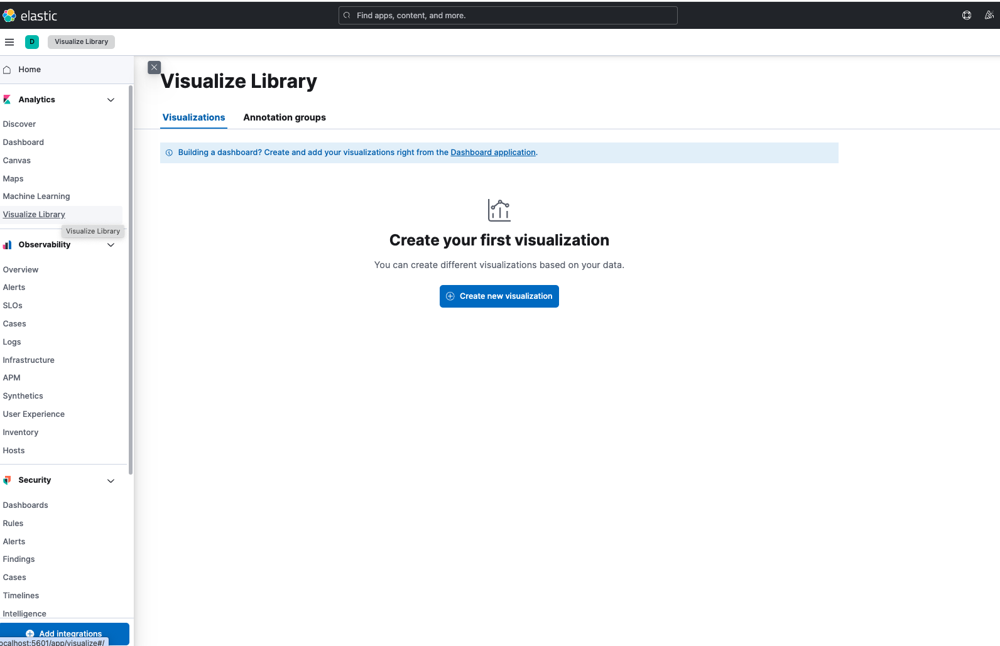
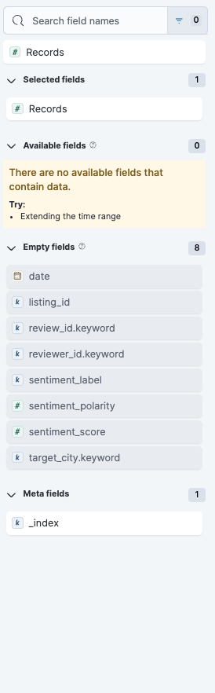
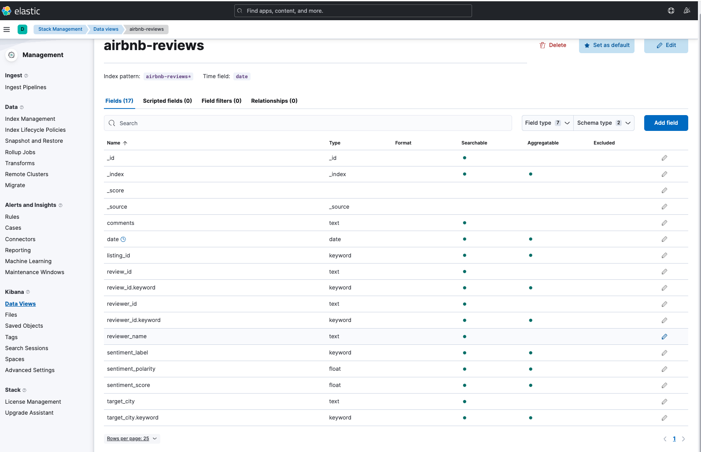
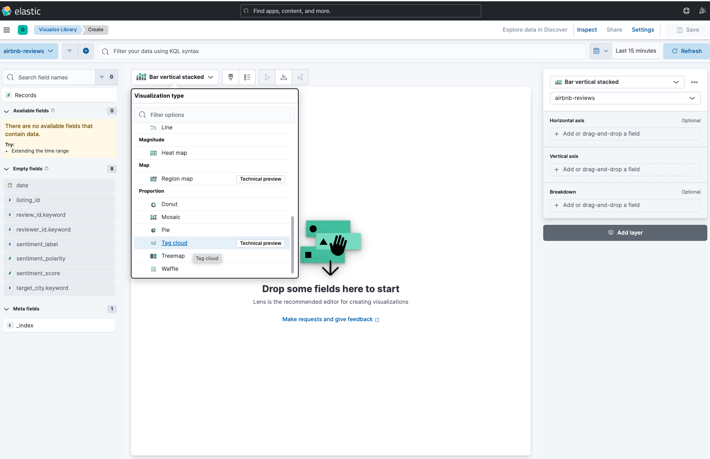
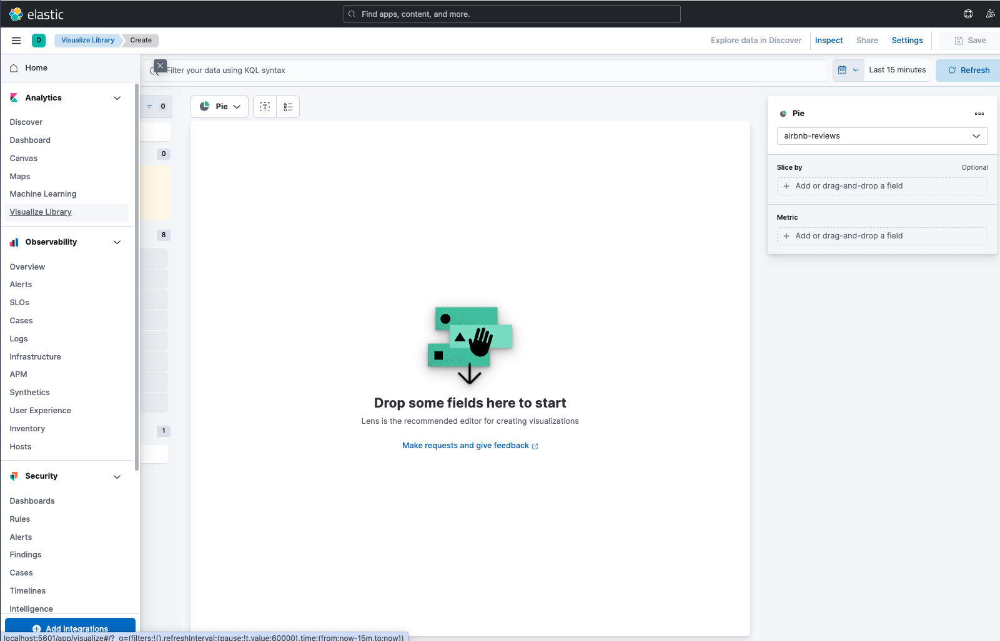
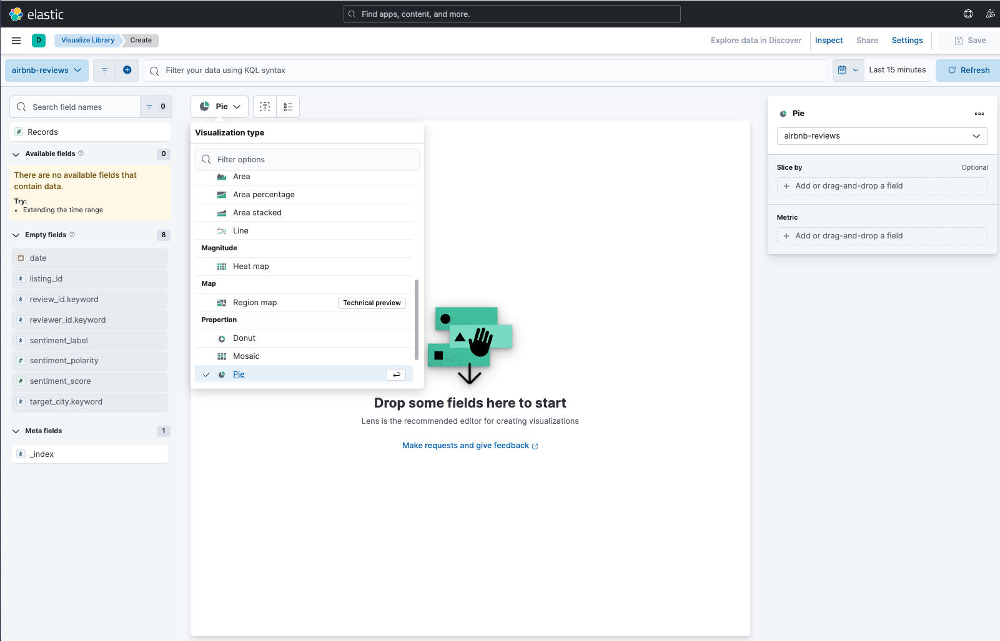
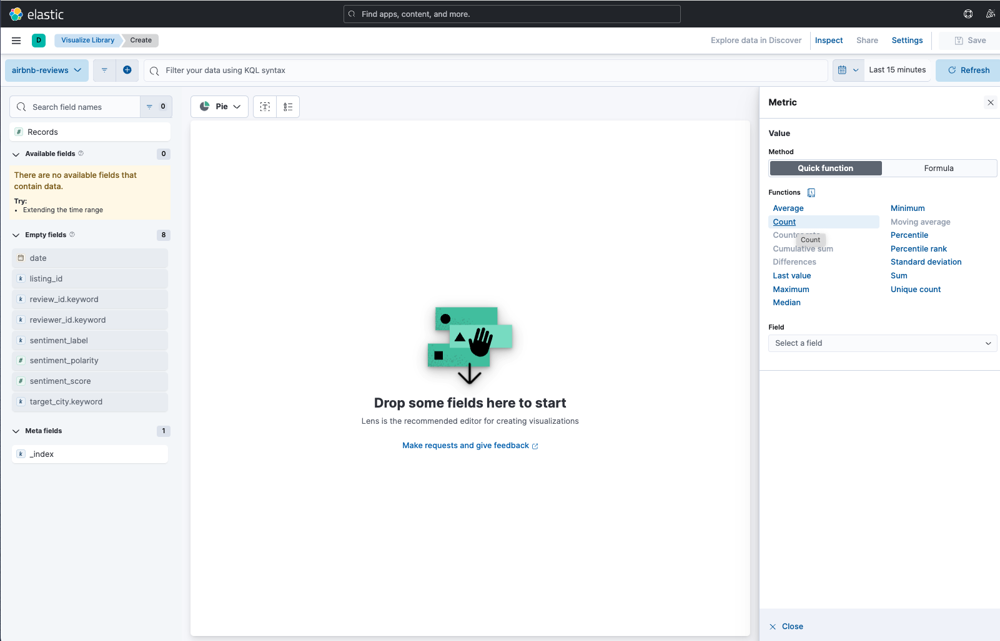
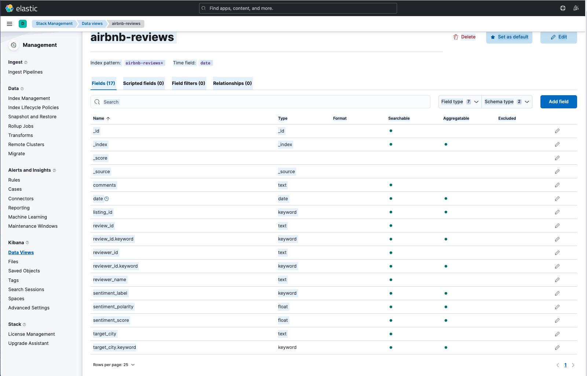
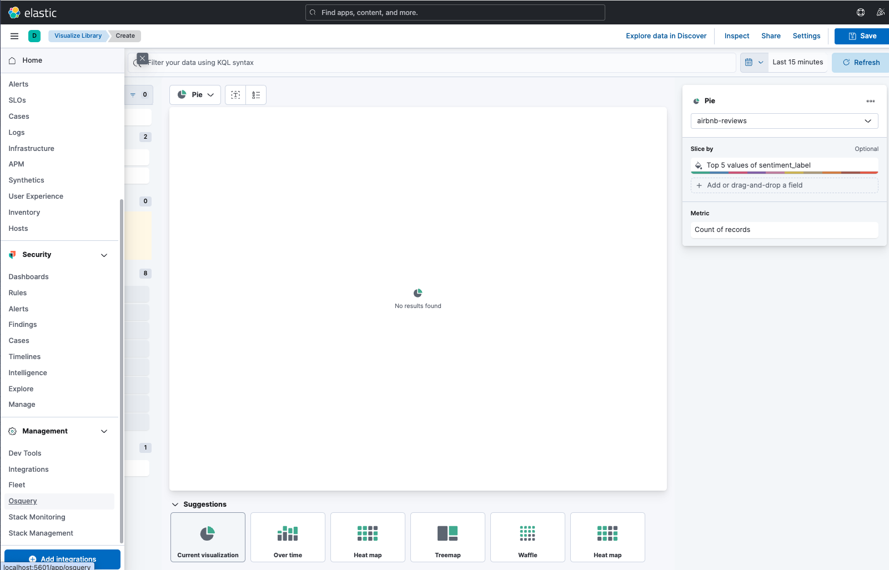

## 1) Créer l'index airbnb-listings avec ton mapping (Kibana → Dev Tools)

⚠️ Si l'index existe déjà, supprime-le d'abord : `DELETE airbnb-listings`

```json
PUT airbnb-listings
{
  "mappings": {
    "properties": {
      "id": { "type": "keyword" },
      "name": { "type": "text" },
      "host_id": { "type": "keyword" },
      "host_is_superhost": { "type": "keyword" },
      "neighbourhood_cleansed": { "type": "keyword" },
      "room_type": { "type": "keyword" },
      "target_city": { "type": "keyword" },
      "price": { "type": "float" },
      "review_scores_rating": { "type": "float" },
      "accommodates": { "type": "integer" },
      "bedrooms": { "type": "integer" },
      "beds": { "type": "integer" },
      "number_of_reviews": { "type": "integer" },
      "minimum_nights": { "type": "integer" },
      "location": { "type": "geo_point" }
    }
  }
}
```

## 2) Script 1 — 1_clean_data.py (fusion + nettoyage → Parquet)

Crée un fichier `1_clean_data.py`.

### Lancer le nettoyage

```bash
python3 1_clean_data.py \
  --bangkok ./listings_bangkok.csv \
  --barcelona ./listings_barcelona.csv \
  --out ./airbnb_clean.parquet
```

**Dépendances :** `python3 -m pip install pandas pyarrow`

```bash
romain@MacBook-Air-de-Romain mon projet % python3 1_clean_data.py \
  --bangkok ./listings_bangkok.csv \
  --barcelona ./listings_barcelona.csv \
  --out ./airbnb_clean.parquet
[OK] Export parquet: airbnb_clean.parquet
[STATS] rows=48216
[STATS] missing_price=9667 (20.05%)
[STATS] missing_location=0 (0.00%)
```

## 3) Script 2 — 2_send_to_elk.py (Parquet → Elasticsearch / Bulk)

Crée un fichier `2_send_to_elk.py`.

### Lancer l'injection

```bash
python3 -m pip install elasticsearch
python3 2_send_to_elk.py --parquet ./airbnb_clean.parquet --index airbnb-listings
```

```bash
romain@MacBook-Air-de-Romain mon projet % python3 -m pip install elasticsearch
python3 2_send_to_elk.py --parquet ./airbnb_clean.parquet --index airbnb-listings

Requirement already satisfied: elasticsearch in /Library/Frameworks/Python.framework/Versions/3.12/lib/python3.12/site-packages (8.19.3)
Requirement already satisfied: elastic-transport<9,>=8.15.1 in /Library/Frameworks/Python.framework/Versions/3.12/lib/python3.12/site-packages (from elasticsearch) (8.17.1)
Requirement already satisfied: python-dateutil in /Library/Frameworks/Python.framework/Versions/3.12/lib/python3.12/site-packages (from elasticsearch) (2.9.0.post0)
Requirement already satisfied: typing-extensions in /Library/Frameworks/Python.framework/Versions/3.12/lib/python3.12/site-packages (from elasticsearch) (4.15.0)
Requirement already satisfied: urllib3<3,>=1.26.2 in /Library/Frameworks/Python.framework/Versions/3.12/lib/python3.12/site-packages (from elastic-transport<9,>=8.15.1->elasticsearch) (2.6.2)
Requirement already satisfied: certifi in /Library/Frameworks/Python.framework/Versions/3.12/lib/python3.12/site-packages (from elastic-transport<9,>=8.15.1->elasticsearch) (2026.1.4)
Requirement already satisfied: six>=1.5 in /Library/Frameworks/Python.framework/Versions/3.12/lib/python3.12/site-packages (from python-dateutil->elasticsearch) (1.17.0)

[notice] A new release of pip is available: 24.3.1 -> 25.3
[notice] To update, run: pip3.12 install --upgrade pip
[OK] Connecté à Elasticsearch: es-node-1 / 8.11.1
/Users/romain/Desktop/Big Data/mon projet/2_send_to_elk.py:54: DeprecationWarning: Passing transport options in the API method is deprecated. Use 'Elasticsearch.options()' instead.
  for ok, item in helpers.streaming_bulk(
[OK] Bulk terminé -> index=airbnb-listings
[STATS] sent=48216 failures=0 (voir bulk_failures.jsonl)
[VERIFY] GET airbnb-listings/_count -> 48216
```

### Vérification dans Kibana

```json
GET airbnb-listings/_count
```

```json
{
  "count": 48216,
  "_shards": {
    "total": 1,
    "successful": 1,
    "skipped": 0,
    "failed": 0
  }
}
```

Parfait ✅ Tout est cohérent :

- `sent=48216`
- `_count=48216` dans Kibana

Ça prouve que :

- tes deux CSV ont bien été fusionnés
- la colonne `target_city` a été ajoutée
- l'indexation Bulk a fonctionné sans erreurs (`failures=0`)
- aucun écrasement de documents (pas de `_id` forcé)

## Validation de l'ingestion (ETL → Elasticsearch)

L'ingestion des données nettoyées a été réalisée via un script Python utilisant l'API Bulk (`helpers.streaming_bulk`).
Le script indexe les documents dans l'index **`airbnb-listings`**.

### Résultat d'exécution du script (preuve)

```text
[STATS] sent=48216 failures=0 (voir bulk_failures.jsonl)
[VERIFY] GET airbnb-listings/_count -> 48216
```

**Conclusion :**

- Le nombre de documents envoyés (`sent`) correspond au nombre de documents présents dans Elasticsearch (`_count`).
- Aucune erreur d'indexation n'a été détectée (`failures=0`).
- L'ingestion est donc complète et fiable.

### Vérification de la présence des 2 villes (target_city)

```json
GET airbnb-listings/_search
```
```json
{
  "size": 0,
  "aggs": {
    "by_city": {
      "terms": {
        "field": "target_city",
        "size": 10
      }
    }
  }
}
```

```json
{
  "took": 80,
  "timed_out": false,
  "_shards": {
    "total": 1,
    "successful": 1,
    "skipped": 0,
    "failed": 0
  },
  "hits": {
    "total": {
      "value": 10000,
      "relation": "gte"
    },
    "max_score": null,
    "hits": []
  },
  "aggregations": {
    "by_city": {
      "doc_count_error_upper_bound": 0,
      "sum_other_doc_count": 0,
      "buckets": [
        {
          "key": "bangkok",
          "doc_count": 28806
        },
        {
          "key": "barcelona",
          "doc_count": 19410
        }
      ]
    }
  }
}
```

**Interprétation :**

- Les deux valeurs `bangkok` et `barcelona` sont bien présentes.
- Chaque document est correctement tagué via la colonne `target_city`.
- La fusion des deux fichiers CSV a donc été réalisée avec succès.


## Ce script enlève bien le $ (et aussi les ,) du prix et convertit en float

### Pourquoi c'est garanti dans ton code

Dans `clean_price_to_float()` :

- `s.str.replace(",", "", regex=False)` ➜ enlève les virgules (séparateurs de milliers)
- `PRICE_CLEAN_RE = re.compile(r"[^\d\.\-]")` ➜ enlève tout ce qui n'est pas chiffre / point / signe -
  👉 donc `$`, espaces, lettres, etc. disparaissent
- `pd.to_numeric(...).astype("float64")` ➜ conversion en nombre décimal

**Donc :**

`"$1,416.00"` → `"1416.00"` → `1416.0`

## Bonus

### Etape 1 : Développement du Script NLP

**Rôle :** Data Scientist

Vous devez développer un script Python nommé `3_analyze_reviews.py`. Ce script sera responsable de l'enrichissement de la donnée.

**Pré-requis techniques :**

- Librairie : TextBlob (pour l'analyse de sentiment).
- Fichier source : `reviews.csv` (contient les commentaires).

**Spécifications du script :**

1. Lecture du fichier CSV par paquets (chunks) pour gérer le volume important de données.
2. Nettoyage basique des commentaires (suppression des lignes vides).
3. Calcul du "Score de Polarité" pour chaque commentaire via TextBlob :
   - Le score va de -1.0 (Très négatif) à +1.0 (Très positif).
4. Création d'un "Label" basé sur le score :
   - Si score < 0 : Label = "Negatif"
   - Si score > 0 : Label = "Positif"
   - Sinon : Label = "Neutre"
5. Envoi des documents enrichis vers un nouvel index Elasticsearch nommé `airbnb-reviews`.

**Dépendances :** `python3 -m pip install pandas elasticsearch textblob`
(et si besoin : `python3 -m textblob.download_corpora`)

### 3_analyze_reviews.py

```bash
python3 3_analyze_reviews.py \
  --bangkok ./reviews_bangkok.csv \
  --barcelona ./reviews_barcelona.csv \
  --es http://localhost:9200 \
  --index airbnb-reviews
```

**Estimation du temps de traitement (machine locale type MacBook)**

| Volume reviews | Temps estimé |
|----------------|--------------|
| ~10 000        | 15–30 s      |
| ~25 000        | 30–90 s      |
| ~50 000        | 1–2 min      |
| ~100 000       | 3–5 min      |

Le temps de traitement est dominé par l'analyse NLP, réalisée commentaire par commentaire.
Grâce au traitement par paquets et à l'indexation Bulk, le pipeline reste performant et scalable,
avec un temps d'exécution de l'ordre de la minute pour plusieurs dizaines de milliers de commentaires.

```text
[INFO] barcelona chunk 204: processed_rows=4270 total_indexed=1019160 failures=0

[OK] NLP + Bulk terminé
[STATS] indexed=1602423 failures=0 empty_or_blank_rows_skipped=180
[VERIFY] GET airbnb-reviews/_count -> 1602423
[LOG] failures -> reviews_bulk_failures.jsonl
```

**Comment accélérer ?**

- Parallélisation (multiprocessing)
- Modèles plus rapides (VADER, spaCy)
- Offload vers cluster Spark NLP
- Batch inference

**Une barre de progression dans le script :**

```bash
python3 -m pip install tqdm
```

Ajoute l'import en haut : `from tqdm import tqdm`

## NLP – Ingestion et enrichissement des avis (TextBlob → Elasticsearch)

### Objectif

Analyser les commentaires du fichier `reviews` afin de transformer du texte libre en indicateurs quantifiables :

- **score de polarité** (TextBlob) : -1 (très négatif) → +1 (très positif)
- **label** dérivé : `Negatif`, `Neutre`, `Positif`

Les données enrichies sont indexées dans un nouvel index Elasticsearch : **`airbnb-reviews`**.

### Résultat d'exécution (preuve)

```text
[OK] NLP + Bulk terminé
[STATS] indexed=1602423 failures=0 empty_or_blank_rows_skipped=180
[VERIFY] GET airbnb-reviews/_count -> 1602423
[LOG] failures -> reviews_bulk_failures.jsonl
```

1 602 423 reviews indexées, 0 échec, seulement 180 lignes vides ignorées.

### Vérifications Kibana (Dev Tools)

#### 1) Vérifier la volumétrie

```json
GET airbnb-reviews/_count
```
```json
{
  "count": 1602423,
  "_shards": {
    "total": 1,
    "successful": 1,
    "skipped": 0,
    "failed": 0
  }
}
```

Le compte est bon.

## Bonus

### Etape 2 : Configuration de l'Index (Mapping)

**Rôle :** Elasticsearch Engineer

Le texte des commentaires est long et complexe. Il nécessite un mapping adapté pour permettre à la fois la recherche de phrases et l'analyse de mots-clés.

**Action dans Dev Tools :**

Créer l'index `airbnb-reviews` avec les propriétés suivantes :

- `listing_id` : keyword (pour faire la jointure mentale avec les annonces).
- `date` : date.
- `reviewer_name` : text.
- `comments` : text (activé pour la recherche plein texte).
- `sentiment_score` : float.
- `sentiment_label` : keyword (pour les filtres et camemberts).

### Création de l'index avec mapping adapté

Supprimer l'index existant : `DELETE airbnb-reviews`

Recréer l'index avec le mapping demandé :

```json
PUT airbnb-reviews
```
```json
{
  "mappings": {
    "properties": {
      "listing_id": {
        "type": "keyword"
      },
      "date": {
        "type": "date"
      },
      "reviewer_name": {
        "type": "text"
      },
      "comments": {
        "type": "text"
      },
      "sentiment_score": {
        "type": "float"
      },
      "sentiment_label": {
        "type": "keyword"
      }
    }
  }
}
```

### Relancer le script NLP

```bash
python3 3_analyze_reviews.py \
  --bangkok ./reviews_bangkok.csv \
  --barcelona ./reviews_barcelona.csv \
  --es http://localhost:9200 \
  --index airbnb-reviews
```

Ou alors `PUT airbnb-reviews-v2` et :

```bash
python3 3_analyze_reviews.py \
  --bangkok ./reviews_bangkok.csv \
  --barcelona ./reviews_barcelona.csv \
  --index airbnb-reviews-v2
```

### 🔹 C'est quoi un script NLP ?

Un script NLP (Natural Language Processing / Traitement du Langage Naturel) est un programme qui analyse du texte écrit par des humains pour en extraire des informations exploitables par une machine.

Contrairement aux chiffres (prix, notes), le texte est :

- non structuré
- subjectif
- ambigu

Le NLP sert à transformer ce texte libre en données mesurables.

**Enrichit la donnée**

**Avant :**

```
"Very noisy apartment, couldn't sleep"
```

**Après NLP :**

```json
{
  "comments": "Very noisy apartment, couldn't sleep",
  "sentiment_score": -0.62,
  "sentiment_label": "Negatif"
}
```

**Pourquoi c'est important pour un investisseur ?**

Parce que :

- une note moyenne peut masquer des problèmes récurrents
- le NLP détecte des signaux faibles (bruit, propreté, humidité, sécurité)

Un script NLP est un programme qui transforme du texte libre en indicateurs quantifiables afin de permettre une analyse automatique de la satisfaction et des risques non visibles dans les données chiffrées.

**Version "Data Scientist" :**

Le script NLP applique des techniques de traitement du langage naturel afin d'extraire un score de sentiment à partir des commentaires utilisateurs.
Il permet d'enrichir les données structurées par une dimension qualitative exploitable pour l'analyse décisionnelle. 

#### 1️⃣ Le problème à résoudre est simple

On cherche à savoir :

- si un avis est globalement positif, neutre ou négatif
- pas à comprendre des nuances linguistiques complexes

**Exemples :**

- `"Very noisy at night"` → négatif
- `"Clean and well located"` → positif

TextBlob fait cela correctement.

#### 2️⃣ TextBlob est rapide et léger

- Pas d'entraînement
- Pas de GPU
- Pas de dépendances lourdes
- Fonctionne en local

**Dans ton cas :**

- 1,6 million de commentaires analysés
- Temps de traitement maîtrisé (quelques minutes)

**TextBlob permet :**

- des agrégations globales (taux de négatif par ville)
- des comparaisons (Bangkok vs Barcelona)
- des dashboards Kibana exploitables

👉 C'est exactement ce qu'un investisseur attend en premier niveau.

TextBlob est suffisant dans ce contexte car l'objectif est une analyse de sentiment globale à grande échelle.
Il offre un excellent compromis entre simplicité, performance et valeur analytique, sans complexité inutile.

On vérifie que le mapping est exact :

```json
GET airbnb-reviews/_mapping
```
```json
{
  "airbnb-reviews": {
    "mappings": {
      "properties": {
        "comments": {
          "type": "text"
        },
        "date": {
          "type": "date"
        },
        "listing_id": {
          "type": "keyword"
        },
        "review_id": {
          "type": "text",
          "fields": {
            "keyword": {
              "type": "keyword",
              "ignore_above": 256
            }
          }
        },
        "reviewer_id": {
          "type": "text",
          "fields": {
            "keyword": {
              "type": "keyword",
              "ignore_above": 256
            }
          }
        },
        "reviewer_name": {
          "type": "text"
        },
        "sentiment_label": {
          "type": "keyword"
        },
        "sentiment_polarity": {
          "type": "float"
        },
        "sentiment_score": {
          "type": "float"
        },
        "target_city": {
          "type": "text",
          "fields": {
            "keyword": {
              "type": "keyword",
              "ignore_above": 256
            }
          }
        }
      }
    }
  }
}
```

**Preuve que ça fonctionne :**

```json
GET airbnb-reviews/_search
```
```json
{
  "size": 5,
  "query": {
    "match": {
      "comments": "noise"
    }
  },
  "_source": ["comments", "sentiment_score", "sentiment_label"]
}
```

```json
{
  "took": 147,
  "timed_out": false,
  "_shards": {
    "total": 1,
    "successful": 1,
    "skipped": 0,
    "failed": 0
  },
  "hits": {
    "total": {
      "value": 10000,
      "relation": "gte"
    },
    "max_score": 7.7285895,
    "hits": [
      {
        "_index": "airbnb-reviews",
        "_id": "ws0tmZsBPhNOaOkLQTit",
        "_score": 7.7285895,
        "_source": {
          "comments": "Noise noise noise during the day! Bad experience in a great apt",
          "sentiment_label": "Positif"
        }
      },
      {
        "_index": "airbnb-reviews",
        "_id": "ecUqmZsBPhNOaOkLxrYo",
        "_score": 7.6836963,
        "_source": {
          "comments": "Street traffic noise, waterpipe noise and ac noise made it difficult to sleep.",
          "sentiment_label": "Negatif"
        }
      },
      {
        "_index": "airbnb-reviews",
        "_id": "0L8omZsBPhNOaOkLqwgq",
        "_score": 7.0590267,
        "_source": {
          "comments": "everythingis OK。 but it's very noise because it located at cross road. very noise!",
          "sentiment_label": "Positif"
        }
      },
      {
        "_index": "airbnb-reviews",
        "_id": "FdMvmZsBPhNOaOkLTiSc",
        "_score": 6.947796,
        "_source": {
          "comments": "Nice hotel, friendly staff. No outside noise but could hear a lot of noise from inside.",
          "sentiment_label": "Positif"
        }
      },
      {
        "_index": "airbnb-reviews",
        "_id": "ttQvmZsBPhNOaOkL20h7",
        "_score": 6.893484,
        "_source": {
          "comments": "To much noise and never all time distrub . I am hole night not sleeping . Too much noise…",
          "sentiment_label": "Positif"
        }
      }
    ]
  }
}
```

```json
GET airbnb-reviews/_search
```
```json
{
  "size": 0,
  "aggs": {
    "score_stats": {
      "stats": {
        "field": "sentiment_score"
      }
    }
  }
}
```

```json
{
  "took": 70,
  "timed_out": false,
  "_shards": {
    "total": 1,
    "successful": 1,
    "skipped": 0,
    "failed": 0
  },
  "hits": {
    "total": {
      "value": 10000,
      "relation": "gte"
    },
    "max_score": null,
    "hits": []
  },
  "aggregations": {
    "score_stats": {
      "count": 0,
      "min": null,
      "max": null,
      "avg": null,
      "sum": 0
    }
  }
}
```

## Bonus

### Etape 3 : Visualisation Textuelle (Tag Cloud)

**Rôle :** Data Analyst

Il est impossible de lire 50 000 commentaires. Vous devez synthétiser les sujets de plainte récurrents.

**Objectif :**

Créer une visualisation de type "Tag Cloud" (Nuage de Mots) dans Kibana.

**Configuration :**

1. Source de données : Index `airbnb-reviews`.
2. Métrique : Count (Nombre d'apparitions).
3. Bucket (Termes) : Champ `comments`.
4. Filtre obligatoire : Filtrer uniquement les documents où `sentiment_label` est égal à `Negatif`.
5. Exclusion : Exclure les mots de liaison courants (stopwords) comme "the", "and", "a", "to", "was".

**Question métier à résoudre :**

Quels sont les 5 mots qui reviennent le plus souvent dans les avis négatifs ? (Exemple attendu : noise, dirty, small, stairs, cold).

Lens, Maps, TSVB, Custom visualisation

**Management**

- Ingest
  - Ingest Pipelines
- Data
  - Index Management
  - Index Lifecycle Policies
  - Snapshot and Restore
  - Rollup Jobs
  - Transforms
  - Remote Clusters
- Migrate
- Alerts and Insights
  - Rules
  - Cases
  - Connectors
  - Reporting
- Machine Learning
- Maintenance Windows

**Kibana**

- Data Views
- Files
- Saved Objects
- Tags
- Search Sessions
- Spaces
- Advanced Settings

**Stack**

- License Management
- Upgrade Assistant

### Pourquoi Lens ?

Parce que :

- tu veux faire un Tag Cloud (nuage de mots),
- à partir d'un champ texte (`comments`),
- avec un filtre métier (`sentiment_label = Negatif`),
- sans code, sans complexité.

```json
GET airbnb-reviews/_mapping/field/comments
{
  "airbnb-reviews": {
    "mappings": {
      "comments": {
        "full_name": "comments",
        "mapping": {
          "comments": {
            "type": "text"
          }
        }
      }
    }
  }
}
```

Le champ `comments` est bon.

## Visualisation Tag Cloud dans Kibana

### Création de la vue



### Le champ comments n'est pas là



### Le champ est bien dans comments



### Lens


### Tag Cloud



### Activation de fielddata sur le champ comments

Si le champ `comments` n'est pas agrégable dans Lens, il faut activer `fielddata` sur ce champ via Dev Tools :

```json
PUT airbnb-reviews/_mapping
{
  "properties": {
    "comments": {
      "type": "text",
      "fielddata": true
    }
  }
}
```

#### Effet technique

Tu autorises Elasticsearch à charger le texte analysé en mémoire.

Cela rend le champ `comments` :

- ❌ **non agrégable** avant
- ✅ **agrégable** maintenant


### Alternative : Créer un nouvel index avec fielddata activé

Si tu préfères créer un nouvel index avec la configuration optimale dès le départ, utilise ces commandes dans Dev Tools :

```json
PUT airbnb-reviews-viz
{
  "mappings": {
    "properties": {
      "listing_id": { "type": "keyword" },
      "date": { "type": "date" },
      "reviewer_name": { "type": "text" },
      "comments": {
        "type": "text",
        "fielddata": true
      },
      "sentiment_label": { "type": "keyword" },
      "sentiment_polarity": { "type": "float" },
      "target_city": { "type": "keyword" }
    }
  }
}
```

```json
POST _reindex
{
  "source": {
    "index": "airbnb-reviews"
  },
  "dest": {
    "index": "airbnb-reviews-viz"
  }
}
```

## Etape 4 : Analyse de la "Vérité" vs "Note Officielle"

**Rôle :** Business Analyst

Vous allez comparer la note officielle Airbnb (étoiles) avec le sentiment réel calculé par votre algorithme.

**Objectif :** Créer un Dashboard de "Qualité Réelle".

**Visualisations à produire :**

1. **Camembert de Sentiment :** Répartition globale (Positif vs Négatif).
2. **Top Flops :** Une liste des appartements ayant le plus grand nombre de commentaires "Négatifs".
3. **Moteur de Recherche de Risques :** Une barre de recherche permettant de trouver instantanément les commentaires contenant les mots : "bed bugs" (punaises de lit), "scam" (arnaque), "police".

**Livrable Final :** Une démonstration montrant comment identifier un appartement risqué en quelques secondes grâce à l'analyse sémantique, même si sa note officielle semble correcte.

### Visualisations du Dashboard







### Vérification rapide (preuve que ça marche)

On exécute cette requête, et elle fonctionne :

```json
GET airbnb-reviews/_search
{
  "size": 0,
  "aggs": {
    "by_label": {
      "terms": {
        "field": "sentiment_label"
      }
    }
  }
}
```

**Résultat :**

```json
{
  "took": 35,
  "timed_out": false,
  "_shards": {
    "total": 1,
    "successful": 1,
    "skipped": 0,
    "failed": 0
  },
  "hits": {
    "total": {
      "value": 10000,
      "relation": "gte"
    },
    "max_score": null,
    "hits": []
  },
  "aggregations": {
    "by_label": {
      "doc_count_error_upper_bound": 0,
      "sum_other_doc_count": 0,
      "buckets": [
        {
          "key": "Positif",
          "doc_count": 1100015
        },
        {
          "key": "Neutre",
          "doc_count": 476983
        },
        {
          "key": "Negatif",
          "doc_count": 25425
        }
      ]
    }
  }
}
```

**Résumé :**

- **Positif** → 1 100 015
- **Neutre** → 476 983
- **Négatif** → 25 425

✅ **Les données sont bien là !**

C'est uniquement Lens qui demandait le mauvais type.

**Pour rappel :** Aucune donnée affichée dans Lens avant la correction.

### Vérification dans la Data View

Dans la Data View `airbnb-reviews`, toutes les données nécessaires pour l'étape 4 sont présentes :



Comme le montre l'image, la Data View contient tous les champs requis pour créer les visualisations du Dashboard :
- `sentiment_label` (keyword) pour le camembert de sentiment
- `sentiment_score` (float) pour les métriques
- `comments` (text) pour la recherche de risques
- `listing_id` (keyword) pour les agrégations par appartement

## Solution si Lens persiste à dire "no data" (fréquent)

Si Lens continue d'afficher "no data" malgré la présence des données dans Elasticsearch, suivez cette procédure :

### Étape 1 — Refresh Data View (OBLIGATOIRE)

1. **Kibana → Stack Management**
2. **Data Views**
3. Clique sur `airbnb-reviews`
4. Bouton **Refresh field list**
5. Confirme

👉 **Ça force Kibana à relire le mapping Elasticsearch**



### Création du Camembert de Sentiment

Pour créer le camembert de sentiment (répartition Positif/Neutre/Négatif), suivez ces étapes dans Lens :

1. **Metric : Count**
   - Dans la section métrique, sélectionnez ou ajoutez **Count** pour compter le nombre de documents

2. **Slice by : sentiment_label**
   - Utilisez le bouton **+ Add or drag-and-drop a field** 
   - Ajoutez le champ `sentiment_label` dans la section **Slice by** (ou **Break down by**)
   - Cela va créer les segments du camembert selon les valeurs du sentiment (Positif, Neutre, Negatif)


### Configuration du Time Filter

Pour que la visualisation affiche correctement toutes les données, il est important de configurer le **Time Filter** :

1. Cliquez sur le sélecteur de temps en haut à droite de Kibana
2. Changez le filtre temporel pour sélectionner **Last 5 years**
3. Cela permet d'inclure toutes les dates des reviews dans l'analyse


Cette configuration permet de visualiser la répartition des avis selon leur sentiment, créant ainsi le **Camembert de Sentiment** nécessaire pour l'étape 4.

### 🎯 Résultat attendu

Un camembert avec 3 parts :

- 🟢 **Positif**
- 🟡 **Neutre**
- 🔴 **Négatif**

👉 **Exactement cohérent avec ton agrégation :**

- **Positif** ≈ 1 100 015
- **Neutre** ≈ 476 983
- **Negatif** ≈ 25 425

### 📝 Remarque technique

Le `sentiment_label` est un champ métier dérivé par NLP. Lens l'utilise comme dimension de segmentation, tandis que la métrique reste un simple comptage de documents. 